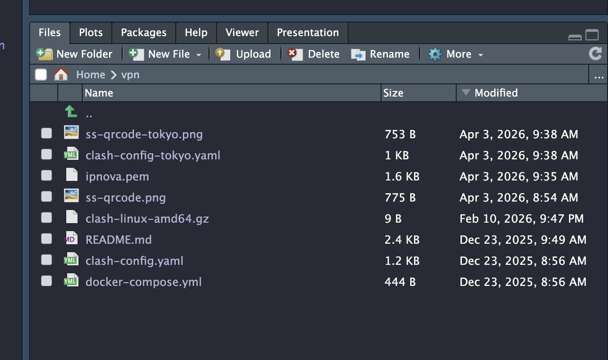
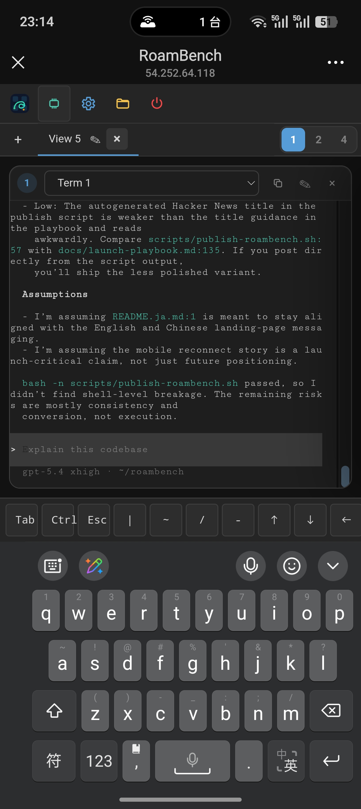

# RoamBench

[English](README.md) | [简体中文](README.zh-CN.md) | [日本語](README.ja.md)

<p align="center">
  <picture>
    <source media="(prefers-color-scheme: dark)" srcset="docs/branding/roambench-lockup-dark.svg">
    
  </picture>
</p>

> Keep your AI coding sessions running. Reconnect from anywhere.

- Keep `tmux` sessions alive
- Run `2 / 4`-pane workspaces for Codex, Claude Code, Kimi-CLI, OpenCode, and other terminal-first tools
- Reconnect from another device, inspect output, and make small file edits without dragging in a full browser IDE

RoamBench is a compact self-hosted remote workbench for one person.

RoamBench is the public-facing product name.

Think of it as the "enough" layer between SSH and a heavy browser IDE: open your machine from anywhere, reconnect to long-running terminal sessions, inspect files, and make small fixes from a laptop or phone without hauling in a full remote desktop stack.

## Why People Open It

- reconnect to a Codex / Claude Code / Kimi-CLI / OpenCode session from another device, including your phone
- keep multiple terminal-first agents running side by side in `2 / 4` panes
- watch scripts, data jobs, and long-running CLI tasks without babysitting SSH
- inspect files, copy outputs, and make lightweight edits away from your desk
- steer terminal-first tools such as `openclaw` without loading a heavy desktop IDE

## Why Not SSH Or A Browser IDE

RoamBench is deliberately narrow: it keeps the highest-value pieces of remote work without trying to become a full browser IDE.

| Need | SSH | VS Code Remote / Browser IDE | RoamBench |
| --- | --- | --- | --- |
| Reconnect to the same long-running session from a phone | awkward | possible, but heavy | built for it |
| Keep `tmux`-backed session recovery easy | manual | not the focus | built-in |
| Run `2 / 4`-pane CLI workflows for coding agents | manual setup | IDE-first | built-in |
| Inspect files and make small edits next to terminals | extra tools | yes, with more overhead | built-in |
| Stay single-user and lightweight on a self-hosted box | yes | usually heavier | yes |

It is not a multi-user platform. It is not trying to replace your full local editor for large edits. It stays opinionated so the UI can remain fast, small, and usable on mobile.

## Screenshots

Desktop workspace with `4` terminals for long-running agent and CLI tasks:


Built-in file browser and editor for lightweight fixes:



Mobile reconnect to the same workspace:



## Workflow Highlights

- Single-user authentication with `password` or `pam`
- IP allowlist support
- terminal session persistence across page reloads and server restarts when `tmux` is available
- disk-backed terminal metadata with a configurable storage cap
- multi-pane workspace tabs with `1 / 2 / 4` layouts and cross-browser sync for the same RoamBench user
- unique terminal assignment across workspaces
- well suited for keeping multiple terminal-first tools running side by side, including Codex, Claude Code, Kimi-CLI, OpenCode, and similar CLI workflows
- built-in file workspace for `New File`, `New Folder`, `Save As`, rename / move, copy, upload, download, delete, and inline image viewing
- draft restore, unsaved-change warnings, clearer save-state feedback, find / replace, go-to-line, and optional line numbers in the editor
- breadcrumb navigation and current-directory filtering in the file browser
- visible right-side terminal scrollbar in each pane
- lightweight, low-overhead behavior intended to stay responsive on modest self-hosted machines
- live memory indicator in the header
- interface language switching for English, Simplified Chinese, and Japanese

## Current Model

RoamBench is intentionally simple:

- it is designed for one Unix user per server process
- the login username must match the Unix account running the RoamBench process
- terminal sessions live on the server
- workspace tabs are stored on the server and cached in the browser
- UI preferences remain browser-local

That means:

- terminal sessions can survive refresh, reconnect, and server restart when `tmux` is available
- workspace names, `1 / 2 / 4` layouts, and per-view terminal placement can follow the same RoamBench user across browsers and devices
- language, font, theme, and editor view preferences remain local to each browser

## Requirements

- Go `1.22+`
- `tmux` recommended for persistent terminal sessions
- Linux or another Unix-like environment with PTY support

Without `tmux`, RoamBench still runs, but terminal session persistence is reduced.

## Fast Path

Fastest setup for trusted local or LAN testing:

```bash
make build
cp configs/roambench.quickstart.toml roambench.toml
APP_BIN=<path-to-binary>         # e.g. ./roambench
APP_CONFIG=<path-to-config-file>  # e.g. ./roambench.toml
"$APP_BIN" --password-hash
export ROAMBENCH_USER="$(whoami)"
export ROAMBENCH_PASSWORD_HASH='<paste the generated hash>'
APP_CONFIG=${APP_CONFIG:-roambench.toml}
"$APP_BIN" --config "$APP_CONFIG"
```

Notes:

- this path is intentionally optimized for setup speed, not hardening
- `configs/roambench.quickstart.toml` enables insecure HTTP and disables IP filtering
- use it only on trusted local or LAN environments
- for a safer deployment, follow the full setup below

## Full Setup

1. Build the binary:

   ```bash
   make build
   ```

2. Copy the example config:

   ```bash
   cp configs/roambench.example.toml roambench.toml
   ```

3. Export the binary and config you are using for this setup:

   ```bash
   APP_BIN=<path-to-binary>         # e.g. ./roambench
   APP_CONFIG=${APP_CONFIG:-roambench.toml}
   ```

4. Edit `roambench.toml`:

   - set `[auth].single_user` to the Unix account that runs the service today via `"$APP_BIN"`
   - set `[server].allowed_ips` or enable `allow_all_ips = true` for trusted testing
   - review the terminal persistence settings

5. Generate a password hash:

   ```bash
   "$APP_BIN" --password-hash
   ```

6. Put the generated hash into `password_hash` in `roambench.toml`.

7. Start RoamBench:

   ```bash
   "$APP_BIN" --config "$APP_CONFIG"
   ```

8. Open the server in your browser.

## Build And Run

```bash
make build
make run
go test ./...
```

PAM build:

```bash
make build-pam
```

## Upgrade Notes

- front-end assets are embedded into the Go binary
- after changing files under [web](web), rebuild and restart the RoamBench service to serve the updated UI
- without `tmux`, restarting the RoamBench service can interrupt active shells and running tasks

## Configuration

RoamBench currently looks for config files in this order:

1. `./roambench.toml`
2. `~/.config/roambench/roambench.toml`
3. `/etc/roambench/roambench.toml`

You can also pass an explicit config path:

```bash
./roambench --config /path/to/roambench.toml
APP_BIN=<path-to-binary> # e.g. ./roambench
"$APP_BIN" --config /path/to/roambench.toml
```

Useful CLI flags:

- `--config`: explicit config file path
- `--host`: override config host
- `--port`: override config port
- `--password-hash`: generate a `bcrypt` hash from stdin and exit

More details:

- [Roadmap](docs/roadmap.md)
- [Launch Playbook](docs/launch-playbook.md)
- [GitHub Release Checklist](docs/github-release-checklist.md)
- [Lightweight Evidence](docs/lightweight-evidence.md)
- [Rebrand Checklist](docs/rebrand-checklist.md)
- [Deployment Hardening](docs/deployment-hardening.md)
- [Configuration Guide](docs/configuration.md)
- [Authentication Guide](docs/authentication.md)
- [Contributing](CONTRIBUTING.md)
- [Security Policy](SECURITY.md)
- [GitHub Release Copy](docs/github-release-v0.3.0.md)
- [GitHub Publishing Notes](docs/github-publishing.md)
- [Changelog](CHANGELOG.md)
- [License](LICENSE)

## Terminal Persistence

When `tmux` is available, RoamBench uses it as the terminal backend.

- terminal metadata is persisted to disk
- idle sessions are removed after `terminal.idle_timeout`
- persisted metadata is capped by `terminal.persist_max_bytes`
- by default the metadata directory is `~/.local/state/roambench/terminals`

This keeps memory usage low while still allowing session recovery after restart.

Without `tmux`, RoamBench still works, but server restart safety is reduced and active tasks may be interrupted.

## Workspaces

The browser UI supports workspace tabs with `1 / 2 / 4` terminal panes.

- each workspace can be renamed
- each workspace can use a different layout
- each terminal can appear only once across workspaces
- workspace state is persisted on the server for the current RoamBench user
- the browser keeps a local cached copy as a fallback

## File Tools

RoamBench includes a lightweight browser-side workspace for server files:

- directory listing with sorting, hidden-file toggle, breadcrumb navigation, and current-directory filtering
- text file editing with draft recovery, find / replace, go-to-line, and optional line numbers
- `New File`, `New Folder`, `Save As`, rename / move, and copy
- upload and download
- image preview in the built-in viewer

The file browser is rooted in the authenticated user's home directory.

## Security Notes

- RoamBench is single-user only
- default deployments should keep IP filtering enabled
- for non-loopback hosts, RoamBench expects TLS unless `allow_insecure_http = true` is explicitly enabled

## Project Layout

- [cmd/roambench](cmd/roambench) - CLI entrypoint
- [internal/auth](internal/auth) - authentication and sessions
- [internal/server](internal/server) - HTTP server and API
- [internal/terminal](internal/terminal) - terminal session manager
- [internal/filebrowser](internal/filebrowser) - file browser backend
- [web](web) - embedded front-end assets

## Status

The project is already usable for self-hosted single-user workflows, especially terminal-first coding, agent supervision, and lightweight remote intervention, but it is still intentionally compact and opinionated.
