# Information Architecture

## 设计原则

1. **不破坏现有 Terminal 体验** — 用户打开 RoamBench 仍然看到熟悉的终端工作区
2. **通过标签切换进入项目面板** — 顶层只有两个模式：Terminal 和 Project Panel
3. **项目面板内是逐层递进** — Project → Workstream → Task → Session，不是平铺 8 个导航
4. **Terminal 同时也是 Session 的执行视图** — 点击某个 Task 的 Session 时，可以直接 attach 到对应终端

## 1. 顶层模式切换

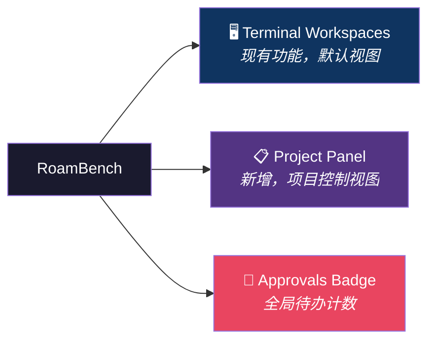

- **Terminal Workspaces**：现有的 1/2/4 分屏终端，完全保留，是默认首页
- **Project Panel**：新增标签，切入项目控制视图
- **Approvals Badge**：全局悬浮或嵌入 header，显示待审批数量，点击进入审批列表

## 2. 项目面板：逐层递进结构

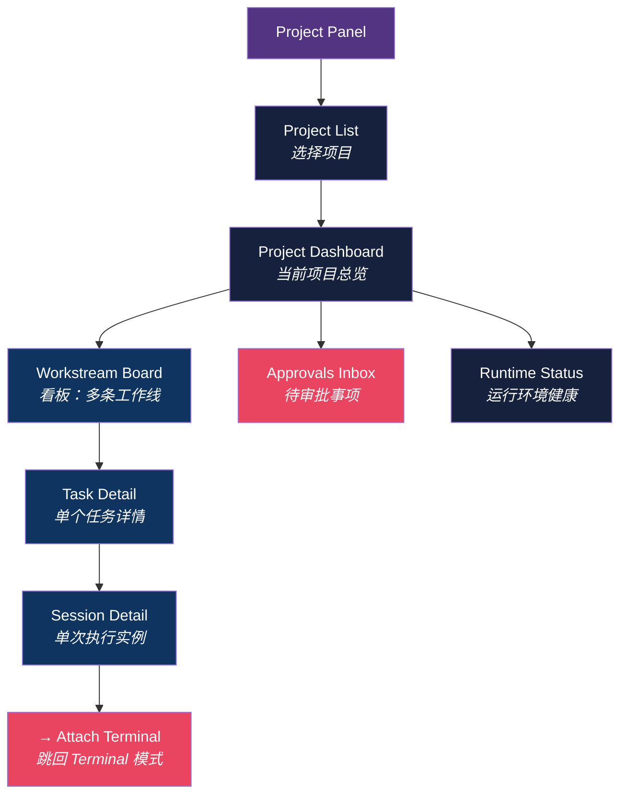

用户的浏览路径是：

```
Project Panel → 选择项目 → Project Dashboard → 点击某条工作线
→ Workstream Board → 点击某个任务 → Task Detail → 点击某个 Session
→ Session Detail → Attach Terminal（跳回终端模式）
```

## 3. 每一层看到什么

### 3.1 Project Dashboard（项目总览）

从 Project List 点击某个项目后进入。一屏展示项目态势。

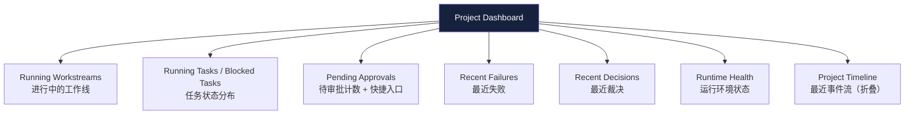

### 3.2 Workstream Board（工作线看板）

点击 Dashboard 中某条工作线，或直接从 Dashboard 的工作线列表进入。

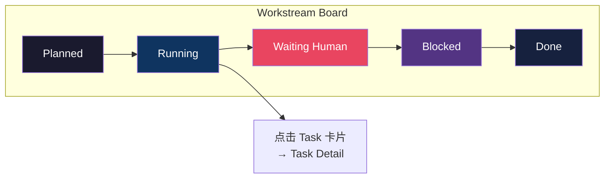

每张 Task 卡片显示：标题、agent、runtime、状态、风险、最近摘要。

### 3.3 Task Detail（任务详情）

点击 Board 中某个 Task 卡片后进入。这是信息最密的页面。

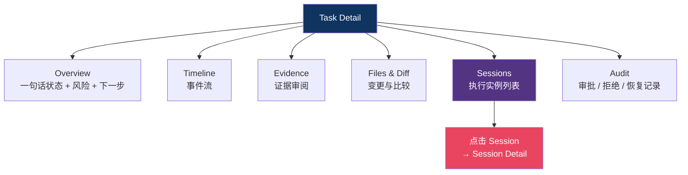

**注意**：Terminal 不再作为 Task Detail 的一个 tab。而是在 Session Detail 里提供 "Attach Terminal" 操作，自然地跳回终端模式。

### 3.4 Session Detail（会话详情）

点击 Task Detail 的 Sessions 列表中某个 Session 后进入。

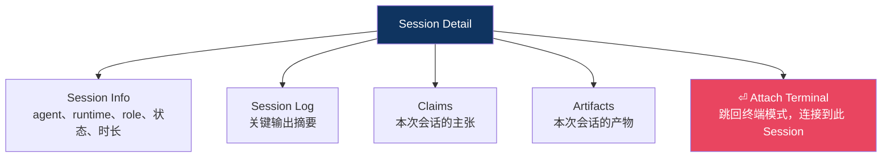

`Attach Terminal` 是 Project Panel 和 Terminal Workspaces 之间的桥梁：

- 点击后切换回 Terminal 模式，自动连接到该 Session 对应的 tmux session
- 用户可以直接操作终端，完成后切回 Project Panel 继续追踪

### 3.5 Approvals Inbox（审批收件箱）

从 Project Dashboard 的 "Pending Approvals" 或全局 Badge 进入。

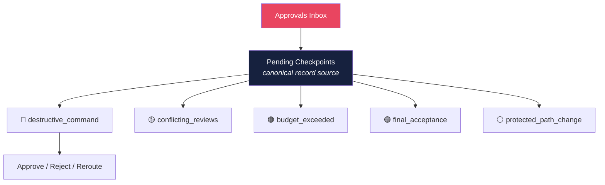

所有审批项都是 `pending checkpoints` 的过滤视图，不是独立数据源。

## 4. 两个模式之间的桥接

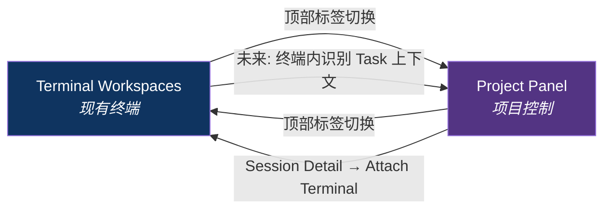

关键设计：

- 两个模式是**平级标签切换**，不是层级嵌套
- Project Panel → Terminal 的桥是 "Attach Terminal"
- Terminal → Project Panel 的桥是顶部标签（未来可做：终端内识别当前 Task 上下文后，提供快捷跳转）

## 5. 核心对象关系

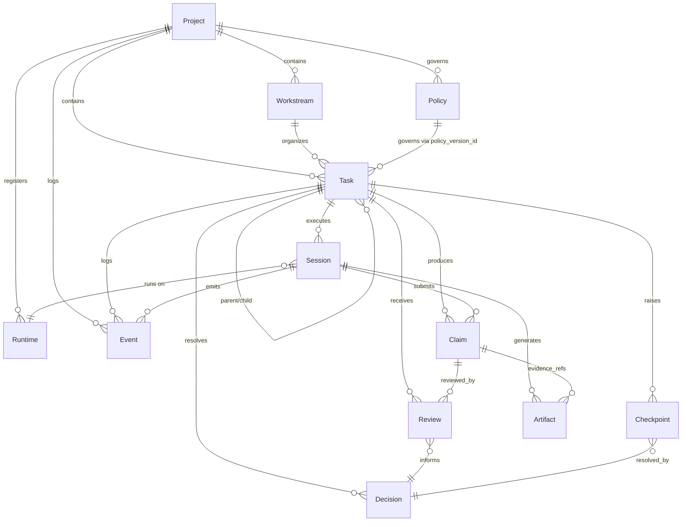

## 6. 三条核心链

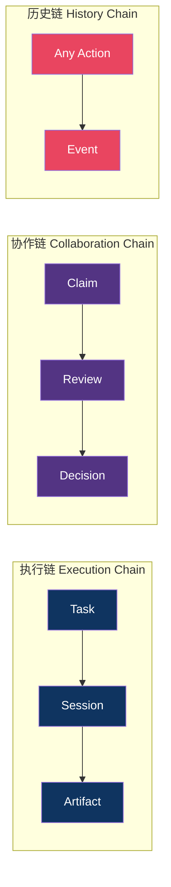

## 7. Task 状态机

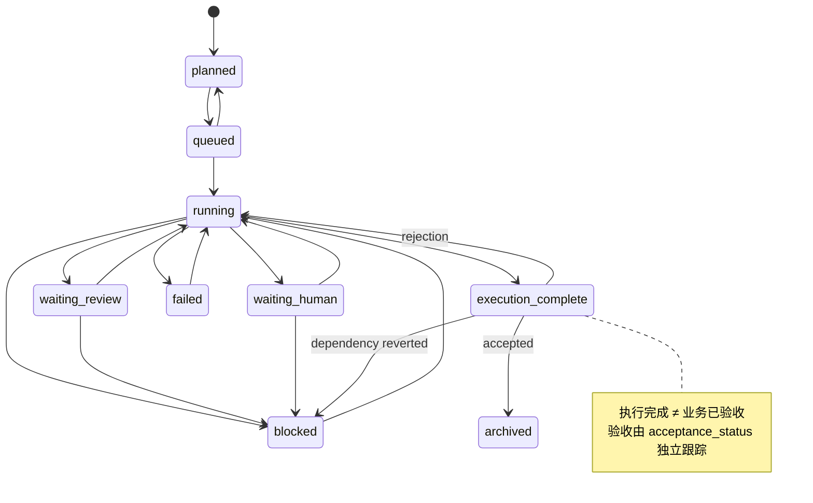

## 8. Acceptance Status 生命周期

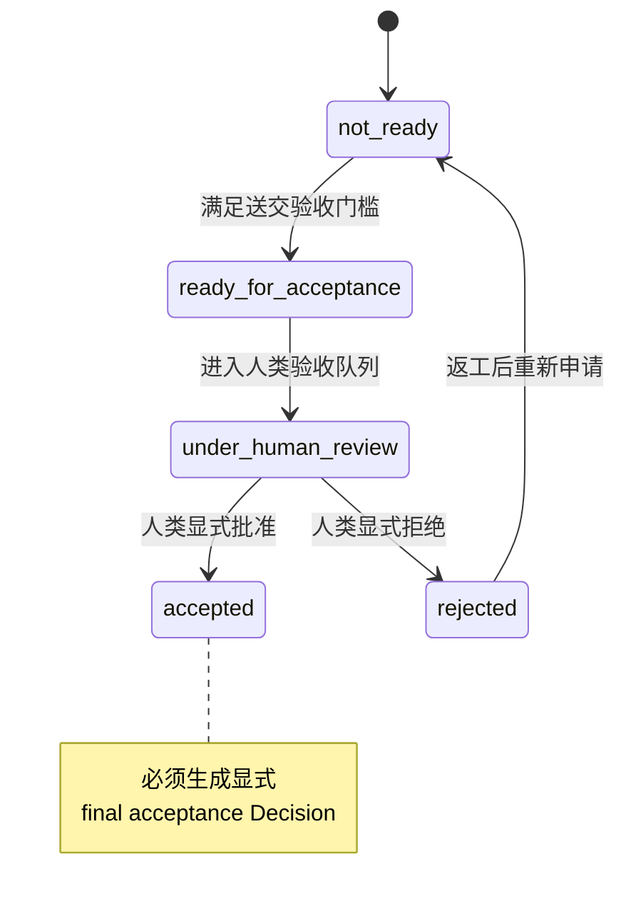

## 9. Session 状态机

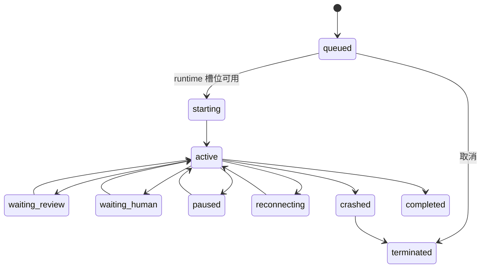

## 10. 协作协议流程

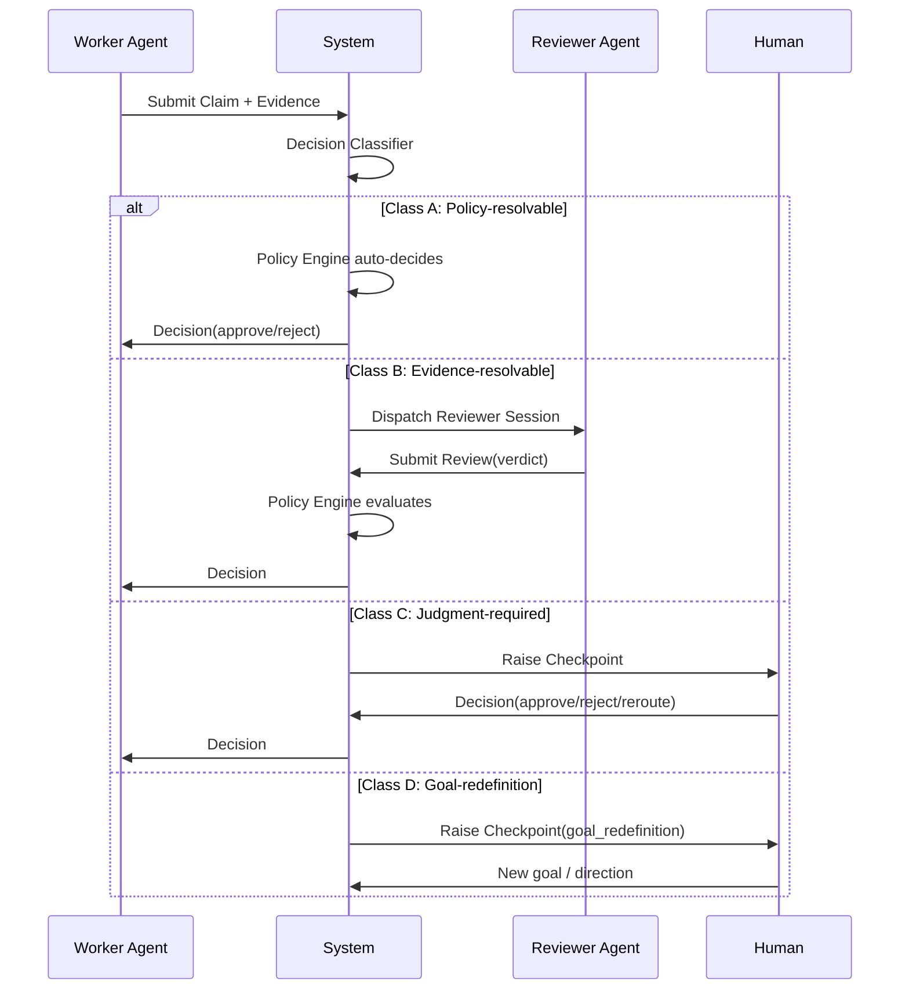

## 11. 自治与预算控制

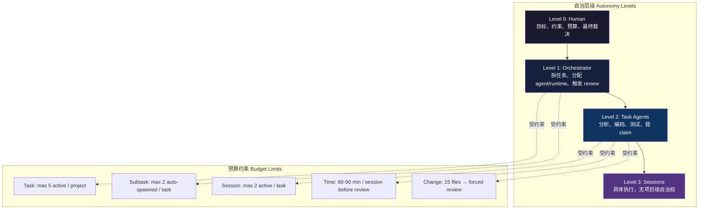

## 12. 三层摘要

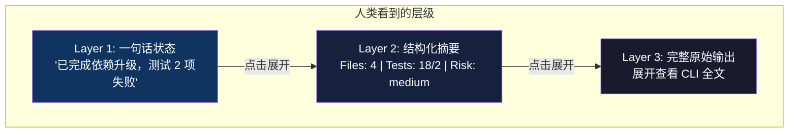

## 13. 实施阶段

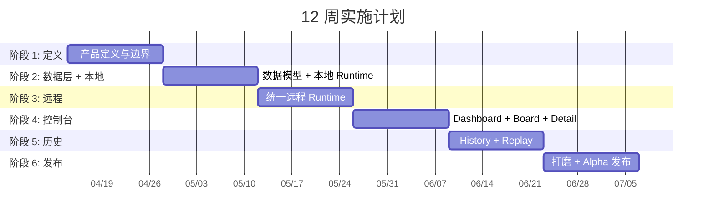
