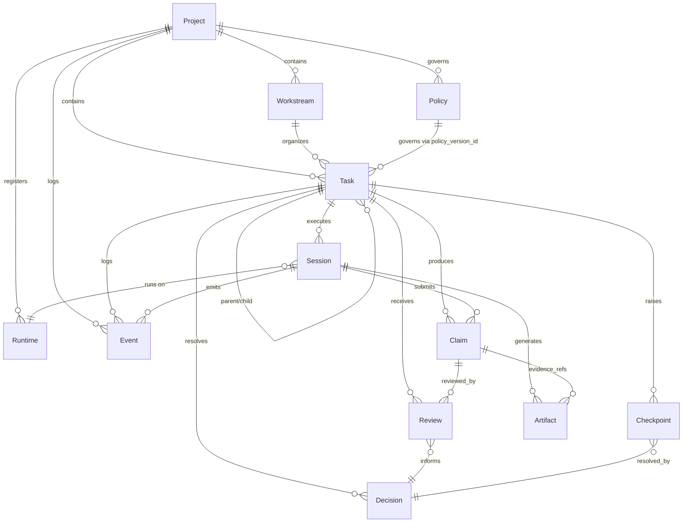
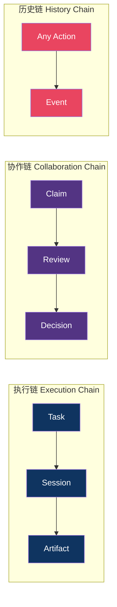
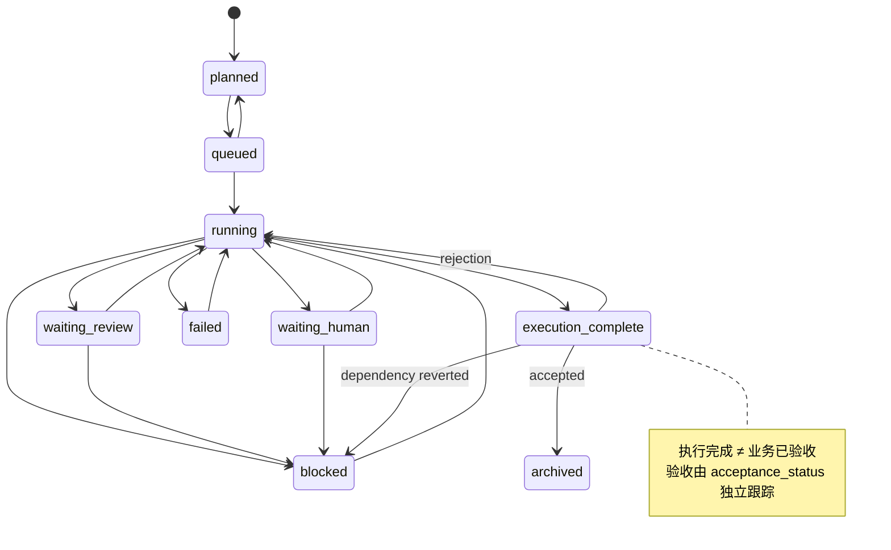
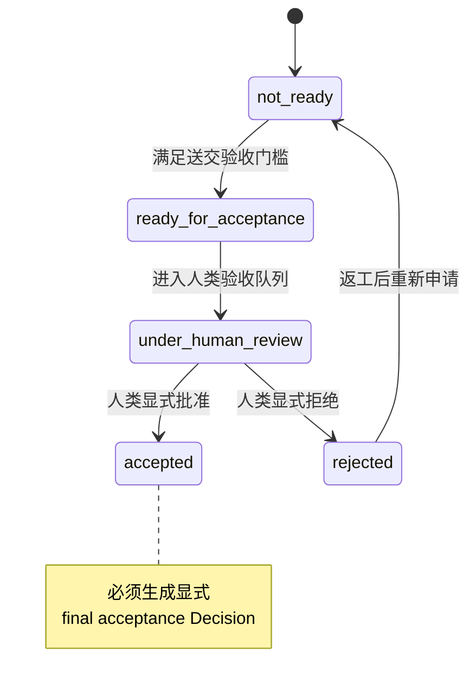
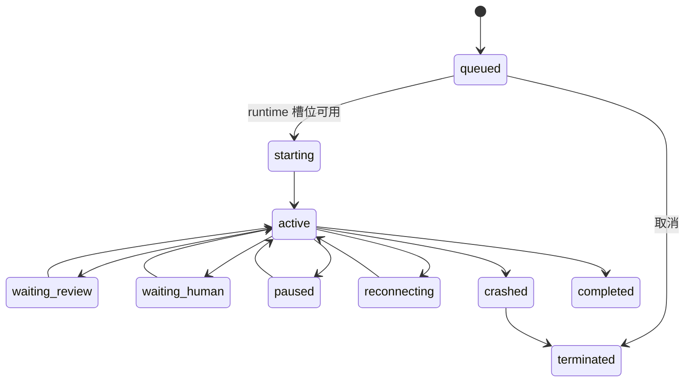
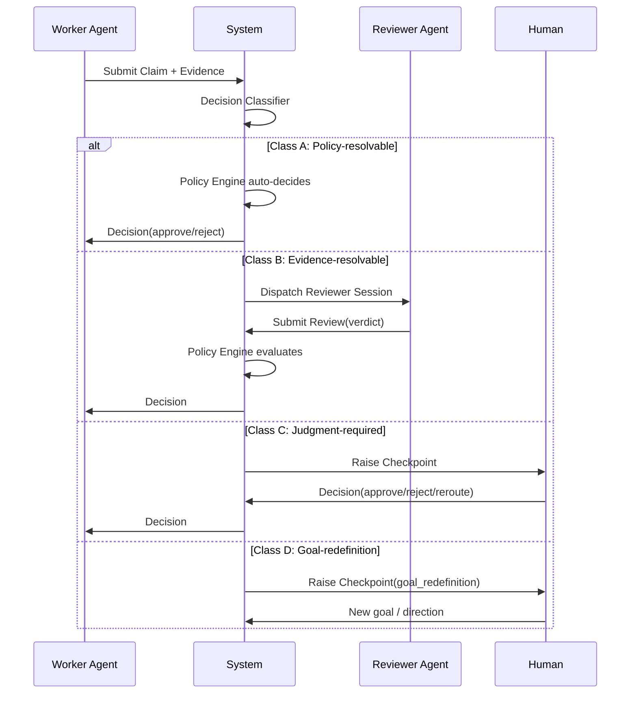
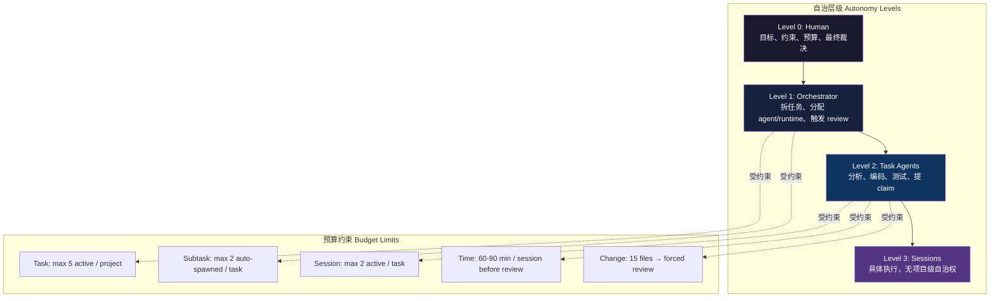
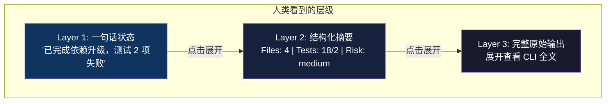
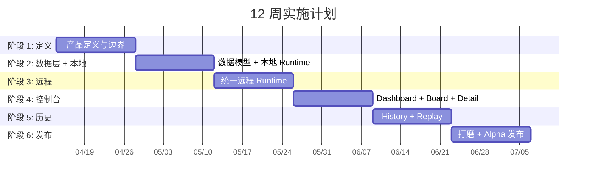

# Information Architecture

## 1. 一级导航与页面层级

```mermaid
graph TD
    APP["RoamBench Control Plane"]

    APP --> PROJ["Projects"]
    APP --> WS["Workstreams"]
    APP --> TASK["Tasks"]
    APP --> TL["Timeline"]
    APP --> EV["Evidence"]
    APP --> APR["Approvals"]
    APP --> HIST["History / Replay"]
    APP --> RT["Runtimes"]

    PROJ --> PD["Project Dashboard"]
    PD --> PD_RW["Running Workstreams"]
    PD --> PD_RT["Running Tasks"]
    PD --> PD_BT["Blocked Tasks"]
    PD --> PD_PA["Pending Approvals"]
    PD --> PD_HR["High-Risk Changes"]
    PD --> PD_RF["Recent Failures"]
    PD --> PD_RH["Runtime Health"]
    PD --> PD_RD["Recent Decisions"]

    WS --> WSB["Workstream Board"]
    WSB --> WSB_P["Planned"]
    WSB --> WSB_R["Running"]
    WSB --> WSB_W["Waiting Human"]
    WSB --> WSB_B["Blocked"]
    WSB --> WSB_D["Done"]

    TASK --> TD["Task Detail"]
    TD --> TD_OV["Overview"]
    TD --> TD_TL["Timeline"]
    TD --> TD_EV["Evidence"]
    TD --> TD_DF["Files & Diff"]
    TD --> TD_TM["Terminal"]
    TD --> TD_AU["Audit"]

    APR --> AI["Approvals Inbox"]
    AI --> AI_CP["Pending Checkpoints"]
    AI --> AI_CR["Conflicting Reviews"]
    AI --> AI_BE["Budget Exceeded"]
    AI --> AI_FA["Final Acceptance"]

    RT --> RM["Runtime Manager"]
    RM --> RM_L["Local"]
    RM --> RM_R["Remote SSH"]
    RM --> RM_C["Container"]

    style APP fill:#1a1a2e,color:#fff
    style PROJ fill:#16213e,color:#fff
    style WS fill:#16213e,color:#fff
    style TASK fill:#16213e,color:#fff
    style TL fill:#16213e,color:#fff
    style EV fill:#16213e,color:#fff
    style APR fill:#16213e,color:#fff
    style HIST fill:#16213e,color:#fff
    style RT fill:#16213e,color:#fff
    style TD_TM fill:#e94560,color:#fff
```

## 2. 核心对象关系

## 3. 三条核心链

## 4. Task 状态机

## 5. Acceptance Status 生命周期

## 6. Session 状态机

## 7. 协作协议流程

## 8. 自治与预算控制

## 9. 三层摘要

## 10. 实施阶段

